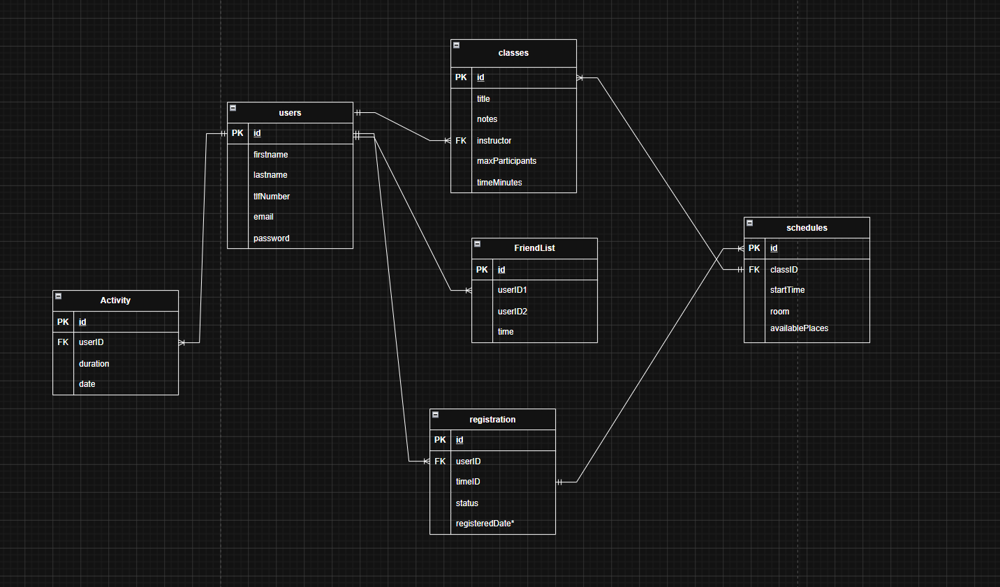

# **Avsluttende Utviklingsprosjekt Vår 2026**
av Felix Ellingsen Westby

| Component | Kodespråk / teknologi |
|-----------|--------------|
| Frontend | HTML5, CSS, JavaScript |
| Backend | Node.JS, Express.JS |
| Database | SQLite |
| Server Port | 3000 |

## Notater

I dette prosjektet skal jeg lage en nettside hvor du logge at du har vært på trening, hvor du kan bli venner med andre brukere. Administrator brukere kan opprette treningstimer som andre brukere kan melde seg på

Hva jeg må ha med
- [X] Database (SQL eller MariaDB)
- [x] Node - app.js
- [x] public mappe
- [x] hidden mappe
- [X] ruter og api endepunkter
- [X] classes - viser klassene

- [ ] friend-list (skrivefunksjon! folk må skrive inn ID-en!)
- [ ] activity (bruke chart-js for å lage statistikk)
- [ ] registration (lage en lenke av url-en)

- [ ] logout (må jobbe mer med)


# Hva jeg lager
I dette prosjektet lager jeg en nettside hvor du kan logge treningen din. Du har mulighet til å registrere at du har trent, og du kan melde deg på en treningstime, dette vil bli registrert som en aktivitet du har deltatt på. Jeg har lagd en funksjon som gjør det mulig å slette brukeren sin.

# Databasen



### users

| Key | Column    | Type                  |
|-----|-----------|-----------------------|
| PK  | id        | INTEGER AUTOINCREMENT |
|     | firstname | TEXT NOT NULL         |
|     | lastname  | TEXT NOT NULL         |
|     | tlfNumber | INTEGER               |
|     | email     | TEXT NOT NULL         |
|     | password  | TEXT NOT NULL         |

### activity

| Key | Column   | Type                                  |
|-----|----------|---------------------------------------|
| PK  | id       | INTEGER AUTOINCREMENT                 |
|     | activity | TEXT NOT NULL                         |
|     | date     | TEXT NOT NULL                         |
|     | duration | INTEGER                               |
| FK  | userID   | INTEGER → users(id) ON DELETE CASCADE |


### classes

| Key | Column          | Type                      |
|-----|-----------------|---------------------------|
| PK  | id              | INTEGER AUTOINCREMENT     |
|     | title           | TEXT NOT NULL             |
|     | notes           | TEXT                      |
| FK  | instructor      | INTEGER → users(id)       |
|     | maxParticipants | INTEGER                   |
|     | timeMinutes     | INTEGER                   |

### friendlist

| Key | Column  | Type                                  |
|-----|---------|---------------------------------------|
| PK  | id      | INTEGER AUTOINCREMENT                 |
| FK  | userID1 | INTEGER → users(id) ON DELETE CASCADE |
| FK  | userID2 | INTEGER → users(id) ON DELETE CASCADE |
|     | time    | INTEGER                               |

### schedules

| Key | Column          | Type                      |
|-----|-----------------|---------------------------|
| PK  | id              | INTEGER AUTOINCREMENT     |
| FK  | classID         | INTEGER → classes(id)     |
|     | startTime       | INTEGER                   |
|     | room            | TEXT NOT NULL             |
|     | availablePlaces | INTEGER                   |

### registration

| Key | Column | Type                       |
|-----|--------|----------------------------|
| PK  | id     | INTEGER AUTOINCREMENT      |
| FK  | userID | INTEGER → users(id)        |
| FK  | timeID | INTEGER → schedules(id)    |
|     | status | TEXT                       |

# Backend

## app.js

Laster ned alle pakker for Node JS
``` js
    const express = require("express");
    const session = require("express-session");
    const app = express();

    const Database = require("better-sqlite3");
    const db = new Database("treningDatabase.db");

    const cors = require("cors");
    app.use(cors());

    const bcrypt = require("bcrypt");

    app.use(express.static("public"));

    app.use(express.json());

    const port = 3000
```

*For å laste ned pakkene du trenger*

``` cmd
npm init -y
npm install express express-session better-sqlite3 cors bcrypt
```

Rute for å starte prosjektet (*bruker port 3000*)

``` JS
app.listen(port, () => {
    console.log(`Server is running on http://localhost:${port}`)
});
```

### **kanskje ha med session koden??????**

Bruker denne funksjonen for å håndtere innloggingen

``` js
// man må ha session for at koden skal funke
function kreverInnlogging(req, res, next) {
    if(!req.session.users) {
        return res.redirect('/index.html');
    }
    next();
}
```

Innlogging og utlogging

``` js
// sjekker at bruker har skrevet riktig passord og email før den gi en session
app.post("/login", async (req, res) => {
    const { email, password } = req.body;
    const users = db.prepare("SELECT * FROM users WHERE email = ?").get(email);
    if (!users) {
        return res.status(401).json({ message: "Wrong email or password" });
    }

    const passordErGyldig = await bcrypt.compare(password, users.password);
    if (!passordErGyldig) {
        return res.status(401).json({ message: "Wrong email or password"})
    }

    req.session.users = { id: users.id, firstname: users.firstname, lastname: users.lastname };
    res.json({ message: "Login successful", redirect: "index2.html" })
})

// ødelegger session når man logger ut
app.post("/logout", (req, res) => {
    req.session.destroy();
    res.json({ message: "You are logged out" });
})
```

Rute for å lage en ny bruker

``` js
app.post("/newUser", async (req, res) => {
    const { firstname, lastname, tlf, email, password } = req.body;
    const saltRounds = 10;
    const hashPassword = await bcrypt.hash(password, saltRounds);
    const stmt = db.prepare("INSERT INTO users (firstname, lastname, tlfNumber, email, password) VALUES (?, ?, ?, ?, ?)");
    const info = stmt.run(firstname, lastname, tlf, email, hashPassword);
    res.json({ message: "New users created", info })
});
```

Ruter som sender deg til en html side

``` js
app.get('/main', kreverInnlogging, (req, res) => {
    res.sendFile(__dirname + "/index.html");
});

app.get('/activity', kreverInnlogging, (req, res) => {
    res.sendFile(__dirname + "/hidden/activity.html");
})

app.get('/friendList', kreverInnlogging, (req, res) => {
    res.sendFile(__dirname + "/hidden/friendList.html");
})

app.get('/classes', kreverInnlogging, (req, res) => {
    res.sendFile(__dirname + "/hidden/classes.html");
})
```

Rute som viser din aktivitet

``` js
app.get('/showYourActivity', kreverInnlogging, (req, res) => {
    try {
        const userID = req.session.users.id;
        const allActivities = db.prepare(`SELECT * FROM activity WHERE userID = ?`).all(userID);
        res.json(allActivities);
    } catch (error) {
        console.error("Error after catching activities:", error);
        res.status(500).json({ message: "Could not get activities" });
    }
})
```

Rute for å legge til en aktivitet (blir også brukt i classes.js)

``` js
app.post('/addActivity', kreverInnlogging, (req, res) => {
    const { activity, date, duration } = req.body;
    const userID = req.session.users.id;
    try {
        const stmt = db.prepare(`INSERT INTO activity (activity, date, duration, userID) VALUES (?, ?, ?, ?)`);
        const info = stmt.run(activity, date, duration, userID);
        res.json({ message: "Activity added successfully", info });
    } catch (error) {
        console.error("Error after catching info:", error);
        res.status(500).json({ message: "Could not send info" });
    }
})
```

Rute for å vise alle klasser

``` js
app.get('/showAllClasses', kreverInnlogging, (req, res) => {
    try {
        const allClasses = db.prepare(`SELECT classes.title, classes.notes,
            users.firstname, users.lastname, classes.maxParticipants, classes.timeMinutes
            FROM classes
            INNER JOIN users
            ON classes.instructor = users.id;`).all();
        res.json(allClasses);
    } catch (error) {
        console.error("Error after catching classes:", error);
        res.status(500).json({ message: "Could not get classes" });
    }
})
```

Ruter som håndterer å slette en bruker

``` js
// dobbeltsjekker at bruker er logget inn med riktig konto
app.post("/loginDelete", kreverInnlogging, async (req, res) => {
    const { email, password } = req.body;
    const users = db.prepare("SELECT * FROM users WHERE email = ?").get(email);
    if (!users) {
        return res.status(401).json({ message: "Wrong email or password" });
    }

    if (users.id !== req.session.users.id) {
        return res.status(403).json({ message: "Wrong email or password" });
    }

    const passordErGyldig = await bcrypt.compare(password, users.password);
    if (!passordErGyldig) {
        return res.status(401).json({ message: "Wrong email or password"})
    }

    res.json({ message: "Successful" });
})

// sletter bruker
app.delete('/deleteUser', kreverInnlogging, (req, res) => {
    const { email, password } = req.body;
    const userID = req.session.users.id;
    try {
        const stmt = db.prepare("DELETE FROM users WHERE id = ?");
        stmt.run(userID)
        req.session.destroy();
        res.json({ message: "User was successfully deleted", redirect: "index.html" })
    } catch (error) {
        console.error("Feil ved sletting av kort:", error);
        res.status(500).json({ message: "Kunne ikke slette kortet" });
    }
})
```


# Frontend

## index - new user - home page

### index.html

``` html
<main>
    <form onsubmit="loginPerson(event)">
        <label for="email">Email:</label>
        <input type="email" id="email" name="email" required><br>

        <label for="password">Password:</label>
        <input type="password" id="password" name="password" required><br>

        <button type="submit">Logg inn</button>
        <p><a href="newUser.html" class="button">New? click here to make a new user!</a></p>
    </form>
</main>
```

### login.js

``` js
async function loginPerson(event) {
    event.preventDefault();

    const email = document.getElementById("email").value;
    const password = document.getElementById("password").value;

    const response = await fetch('/login', {
        method: "POST",
        headers: {
            "Content-Type": "application/json"
        },
        body: JSON.stringify({ email, password })
    });

    const result = await response.json();

    if (response.ok) {
        alert(result.message);
        window.location.href = result.redirect;
    } else {
        alert(result.message);
    }
}
```

---

### newUser.html og js

``` html
<form id="newUserForm">
    <label for="firstname">Firstname:</label>
    <input type="text" id="firstname" name="firstname" required><br>

    <label for="lastname">Lastname:</label>
    <input type="text" id="lastname" name="lastname" required><br>

    <label for="number">Tlf number:</label>
    <input type="text" id="tlf" name="tlf" required><br>

    <label for="email">Email:</label>
    <input type="email" id="email" name="email" required><br>

    <label for="password">Password:</label>
    <input type="password" id="password" name="password" required minlength="6"><br>
    <p id="demo"></p>

    <button type="submit">Create User</button>
</form>

<p><a href="index.html" class="button">Log inn</a></p>
```

``` js
document.getElementById("newUserForm").addEventListener("submit", async function addPerson(event) {
    event.preventDefault();

    const firstname = document.getElementById("firstname").value;
    const lastname = document.getElementById("lastname").value;
    const tlf = document.getElementById("tlf").value;
    const email = document.getElementById("email").value;
    const password = document.getElementById("password").value;

    console.log(email)
    const response = await fetch("/newUser", {
        method: "POST",
        headers: {
            "Content-Type": "application/json"
        },
        body: JSON.stringify({
            firstname,
            lastname,
            tlf,
            email,
            password
        })
        
    });

    const result = await response.json();
    alert(result.message);
    window.location.href='./index.html';
})
```

---

### index2.html

``` html

```

### home.js

## classes

### classes.html

``` html
<main id="classList">

</main>
```

### classes.js

``` js

async function showClasses () {
    const tabellBody = document.querySelector("#classList");
    try {
        const response = await fetch("/showAllClasses")
        if (!response.ok) {
            throw new Error("Could not get the classes. Are you logged in?");
        }

        const classes = await response.json();

        console.log(classes);

        classes.forEach(classItem => {
            const rad = document.createElement("div");
            rad.classList.add('class');

            const title = document.createElement("h1");
            title.textContent = classItem.title;
            rad.appendChild(title);

            const notes = document.createElement("p");
            notes.textContent = "Notes: " + classItem.notes;
            rad.appendChild(notes);

            const fullName = document.createElement("p");
            fullName.textContent = `Instructor: ${classItem.firstname} ${classItem.lastname}`;
            rad.appendChild(fullName);

            const maxParticipants = document.createElement("p")
            maxParticipants.textContent = "Max Participants: " + classItem.maxParticipants;
            rad.appendChild(maxParticipants);

            const timeMinutes = document.createElement("p")
            timeMinutes.textContent = "Duration (minutes): " + classItem.timeMinutes;
            rad.appendChild(timeMinutes);

            const button = document.createElement("button");
            button.textContent = "Register as Activity";
            button.onclick = () => registerClassAsActivity(classItem);
            rad.appendChild(button);

            tabellBody.appendChild(rad);
        });
    } catch (error) {
        console.error("Fail:", error);
        tabellBody.innerHTML = `<div>Could not get the classes: ${error.message}</div>`;
    }
}

async function registerClassAsActivity(classItem) {
    const today = new Date().toISOString().split('T')[0];
    
    try {
        const response = await fetch("/addActivity", {
            method: "POST",
            headers: {
                "Content-Type": "application/json"
            },
            body: JSON.stringify({
                activity: classItem.title,
                date: today,
                duration: classItem.timeMinutes
            })
        });
        
        const result = await response.json();
        alert(result.message);
    } catch (error) {
        console.error("Error registering class as activity:", error);
        alert("Feil: " + error.message);
    }
}
document.addEventListener("DOMContentLoaded", showClasses);
```

## options - delete user

### options.html

``` html

```

### options.js

---

### deleteUser.html

``` html

```

### deleteUser.js

## activity

### activity.html

``` html

```

### activity.js

## GDPR og UU
Jeg følger GDPR med at informasjonen er hemmelig.
Passord blir hashet.
All info om deg blir slettet når brukeren slettes.

Jeg følger UU med å ha mulighet for mobilfunksjonalitet

